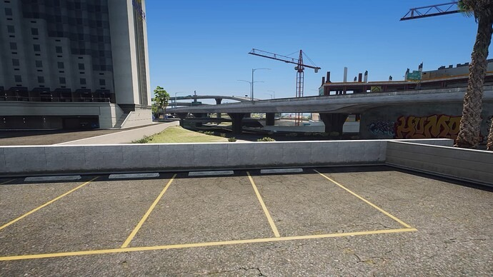
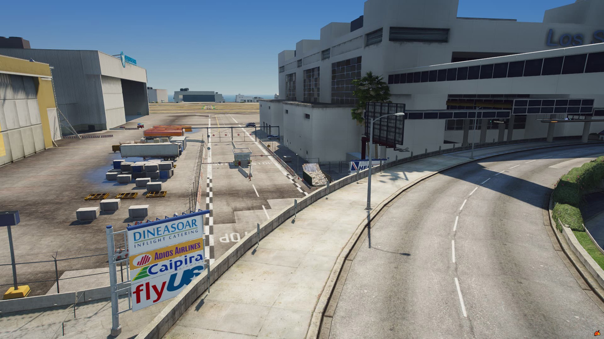
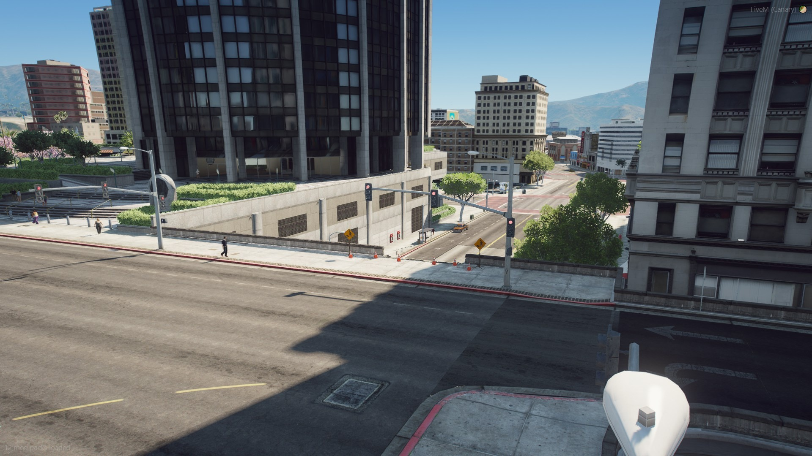
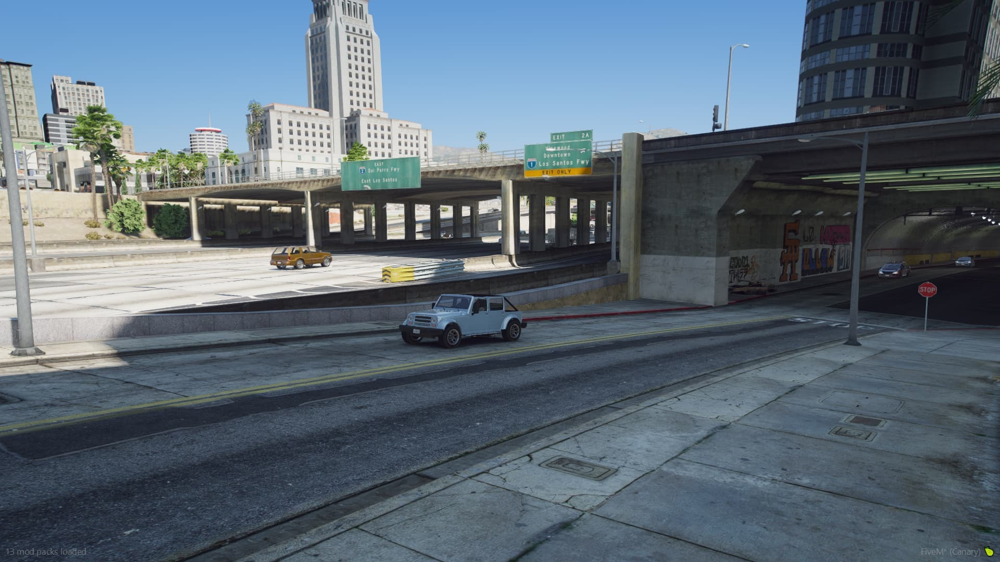
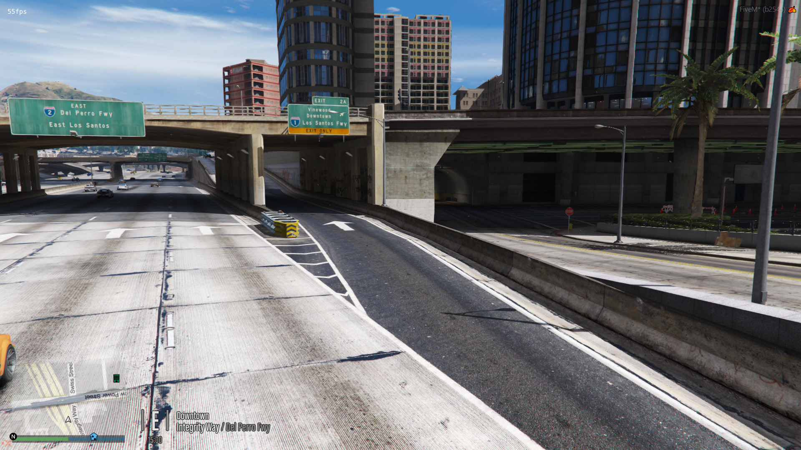
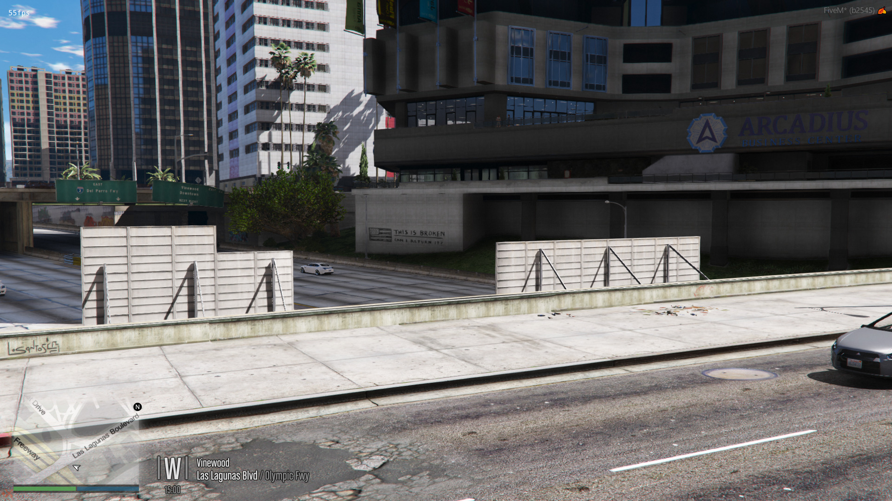
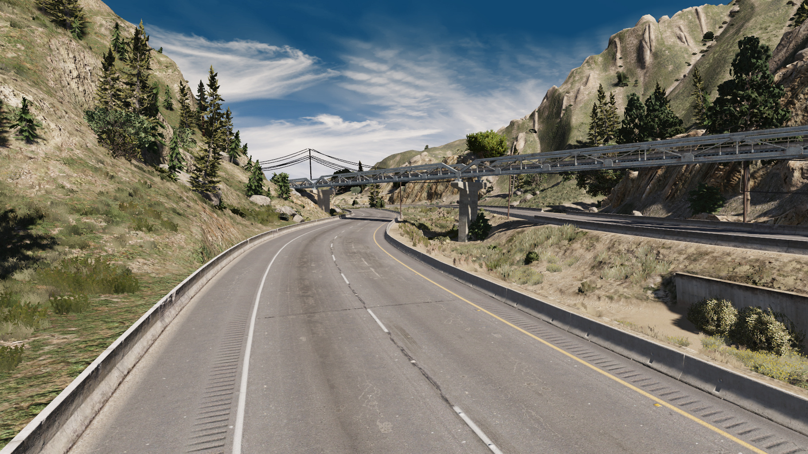
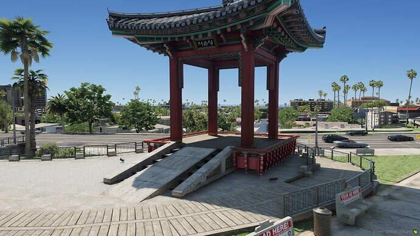
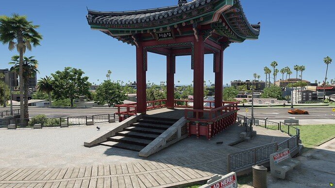

# MapFixes

A compilation of wall and stunt jump fixes for FiveM by community member, [LUKY00010](https://forum.cfx.re/u/luky00010/), made into one resource with slight modifications and additions by [TayMcKenzieNZ](https://github.com/taymckenzienz)

# Screenshots

| | | |
|-|-|-|
|  |  |  |
|  |  |  |
|  |  |  |
|  |  |  |
|  |  |  |
|  |  |  |
|  |  |  |
|  |

---------------------------------------

# Installing

1. Download

2. Open Zip folder and drag MapFixes folder to your server resources folder

3. Add `start MapFixes` to your server.cfg

---------------------------------------

# Suggestion

Run this resource along with [server scenarios](https://github.com/TayMcKenzieNZ/server_scenarios) to remove the construction workers at the [Job Center](https://github.com/TayMcKenzieNZ/WallFixes/blob/main/Wall%20Fixes/Screenshots/c.jpg)

_**Video Previews:**_

**Bridge Preview:**

