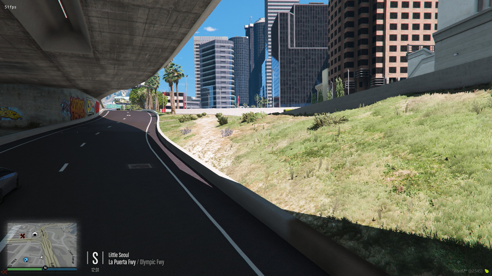

# WallFixes

A compilation of wall fixes for FiveM by community member, [LUKY00010](https://forum.cfx.re/u/luky00010/) with slight modifications and additions by [TayMcKenzieNZ](https://github.com/taymckenzienz)

# Screenshots

| | | |
|-|-|-|
|  |  |  |
|  |  |  |
|  |  |  |
|  |  |  |

---------------------------------------

# Installing

1. Add to your resources folder.

2. Rename to `WallFixes` and add `start WallFixes` to your server.cfg
